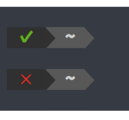

# Powerline Exitstatus

A [Powerline][1] segment for showing exit status.

It will show last exit status.



## Glossary

* `✔`: exit success
* `✕`: exit fail

## Installation
```bash
pip install powerline-exitstatus
```

The Exitstatus segment a couple of custom highlight groups. You'll need to define those groups in your colorscheme, for example in `.config/powerline/colorschemes/default.json`:

```json
{
    "groups": {
        "exit_status_success":        { "fg": "mediumgreen",     "bg": "gray2", "attrs": [] },
        "exit_status_fail":           { "fg": "brightestred",    "bg": "gray2", "attrs": [] }
  }
}
```

Then you can activate the Exitstatus segment by adding it to your segment configuration, for example in `.config/powerline/themes/shell/default.json`:

```json
{
    "function": "powerline_exitstatus.exit_status",
    "priority": 10
}
```

If you want to show exit status only failed, you can enable by setting `only_failed` argument to `true`.
```json
{
    "function": "powerline_exitstatus.exit_status",
    "args": {
        "only_failed": true
    }
}
```

## License
Licensed under [the MIT License][3].

[1]: http://powerline.readthedocs.io/en/master/index.html
[2]: https://github.com/shimtom/powerline-exitstatus/blob/master/screenshot.png 
[3]: https://github.com/shimtom/powerline-exitstatus/blob/master/LICENSE
